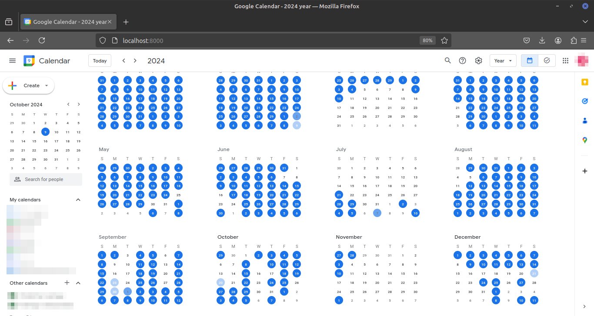

# Bad-Apple-Google-Calendar

Play Bad Apple!! (or any other video file) in [Google Calendar](https://calendar.google.com)



## Setup

1. Install additional pip packages by running `pip install -r requirements.txt`.
2. Log into Google, select *year* in the top-right corner or press [Y] on your keyboard.
3. Then right-click anywhere on the page and select *Save Page as...*
4. Choose the path, where you downloaded this repo in and save it as "index.html".
5. A folder called "index_files" will be created along with the file. You can delete all of its contents, except:
    - calendar_*[something]*.png
    - Every .css file
    - unnamed.png
    - unnamed_*[something]*.png
6. *Aquire* a copy of Bad Apple!! from [The Internet Archive](https://archive.org/details/TouhouBadApple). Oh wait, it's offline... \
¯\\_(ツ)_/¯
7. Insert the following code at the top of `index.html`:
```html
<script src="/badapple.js"></script>
```
8. Run `python3 --video_path [path to bad apple]`
9. Open http://localhost:8000/ in a web browser.
10. Open the developer console (method varies per browser) and switch to the console tab.
11. Ignore all the warnings and type `init()`. If you did everything right, all the days should light up blue.
12. Now type `run()`. A preview window should open and the days in the calendar should start flickering.

> [!TIP]
> Run `python3 main.py` without arguments to see all options available.

## How it works

The main.py script start a Flask and a WebSocket server. The Flask server serves the `index.html` file, `badapple.js` and the `index_files` folder.
The WebSocket server waits for a connection from the hosted webpage and then sends all the frames of the video as strings of ones and zeroes.

On the webbrowser side is `badapple.js` responsible for organizing all of the calendar days into a list, when `init()` is typed into the console. When `run()` is input into the console, the script establishes a connection to the python script and updates every days' color to match the video.